# 《HRMS 项目中的 AI 工程化提效实践》逐页讲稿

> 建议用法：手机打开本文件，配合 `slides/` 目录里的图片熟悉每一页。完整讲下来约 28–32 分钟；正式汇报可按每页重点压缩到 20–22 分钟。

---

## 第 1 页：标题页

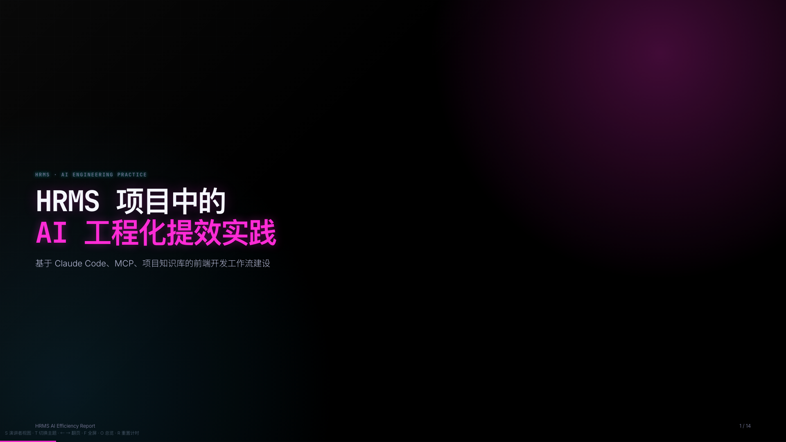

各位好，今天我汇报的主题是 **HRMS 项目中的 AI 工程化提效实践**。

我先说明一下，这次汇报不是介绍某个 AI 工具，也不是说 AI 帮我写了几段代码。

我这段时间做的事情，是围绕 HRMS 项目，把接口文档、页面映射、项目规范、代码模板和 Claude Code 串成了一套可以持续运行的工作流。

以前我们用 AI，更多是临时问一句，让它帮忙写一段代码。但这种方式不稳定，因为 AI 不知道我们项目真实接口，也不知道项目里有哪些规范。

所以我这次的思路是：不是让 AI 凭感觉写代码，而是先把项目资料变成 AI 可以读取的知识，再让 AI 在这些资料和工具约束下辅助开发。

今天我会从几个部分来讲：

第一，为什么 HRMS 项目适合做 AI 提效；第二，这套工作流整体是怎么设计的；第三，Scripts、MCP、Agent、Skill 分别解决什么问题；第四，实际落地到接口同步、页面映射、页面生成时是怎么运转的；最后讲一下真实边界、风险控制和后续规划。

---

## 第 2 页：HRMS 前端开发的现实问题

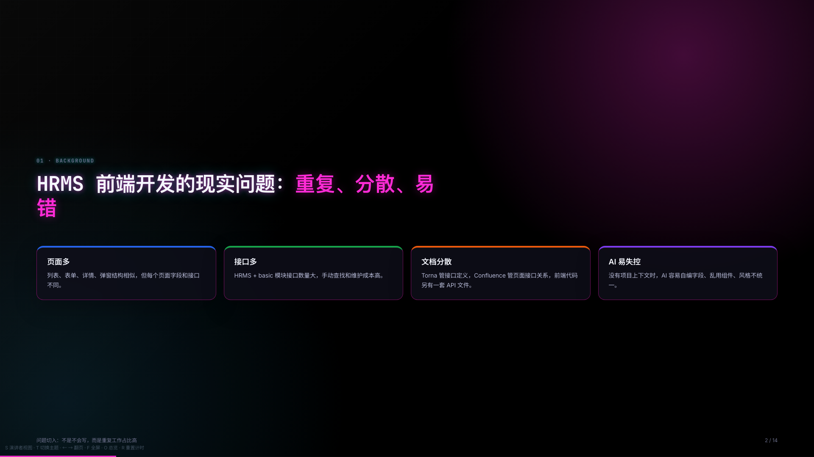

先看背景。

HRMS 这类后台系统有一个很明显的特点：**页面多、接口多、字段多**。

很多页面结构其实是类似的，比如列表页、表单页、详情页、弹窗页。但是每个页面对应的字段、接口、枚举、状态又不一样。

所以前端开发里有很多工作，并不是技术难度特别高，而是非常重复：比如查 Torna 接口、确认入参和出参、写 API 函数、对表格字段、搭列表页骨架、补新增编辑弹窗。

这些工作一多，就容易出现几个问题。

第一，接口文档和前端代码容易不同步。第二，页面到底该用哪些接口，需要去 Confluence、Torna、旧页面里来回翻。第三，字段很多，人工对字段很容易漏。第四，如果直接让 AI 写页面，它没有项目上下文，就容易自编字段、乱用组件，生成出来的代码风格也不统一。

所以我这次的切入点不是“让 AI 直接写页面”，而是先解决一个更底层的问题：**怎么让 AI 看懂我们这个项目。**

---

## 第 3 页：从单次问答到工程化 AI 工作流

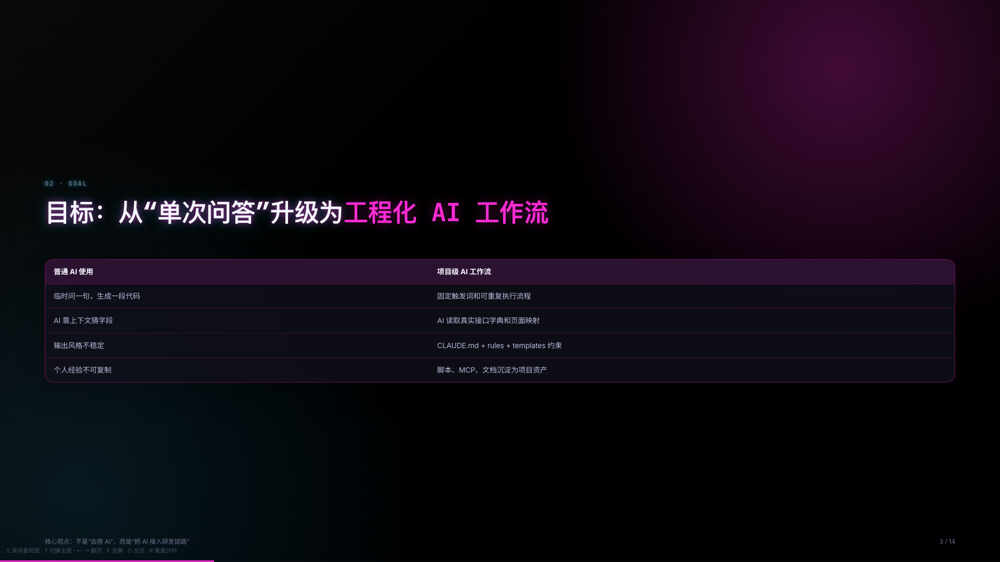

这一页是我这次实践的核心目标。

普通使用 AI，通常是临时问一句：“帮我写一个列表页。”、“帮我封装一个接口。”、“帮我改一下这个组件。”

这种方式短期有用，但是输出不稳定，而且很依赖个人经验。

因为 AI 不知道项目里的真实接口，不知道我们项目用什么组件，不知道按钮应该放哪里，也不知道哪些字段是真的、哪些字段是它根据语义猜出来的。

所以我希望做的不是一次性的 AI 问答，而是项目级的 AI 工作流。

这个工作流要满足几个条件。

第一，要有固定入口，比如“更新 API”、“更新页面映射”、“按设计稿做页面”。第二，要有可重复执行的脚本，而不是每次靠人工操作。第三，要有项目知识库，让 AI 可以读取真实接口、页面关系和开发规范。第四，要有约束和校验，避免 AI 生成不符合项目规范的代码。

也就是说，我希望把 AI 从一个“聊天助手”，变成一个能接入项目研发链路的“工程化开发助手”。

---

## 第 4 页：整体架构

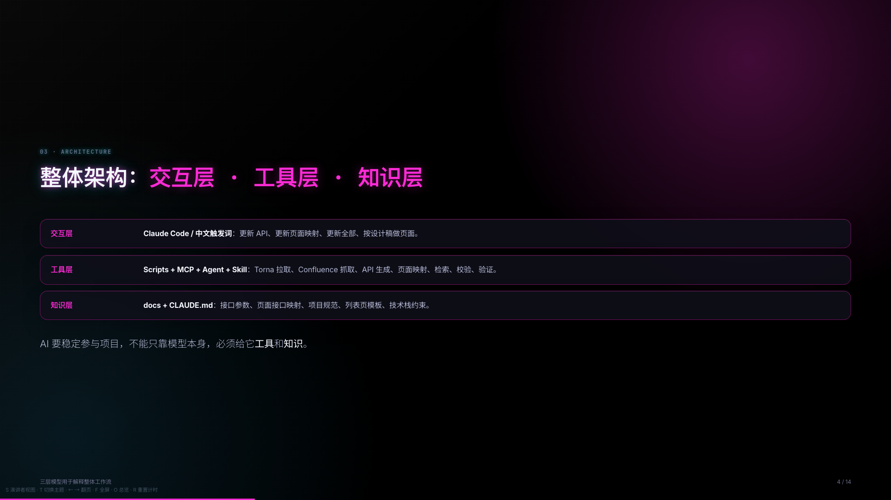

这套体系我把它分成三层。

最上面是**交互层**。

也就是我们日常怎么跟 Claude Code 协作。开发者不需要记复杂命令，可以直接说：“更新 API”、“更新页面映射”、“更新全部”、“按设计稿做这个页面”。

中间是**工具层**。

这里包括 Scripts、MCP、Agent、项目级 Skill。

Scripts 负责确定性的自动化，比如从 Torna 拉接口、生成 API 文件。

MCP 负责连接外部系统，比如 Confluence 和 Figma。

Agent 负责复杂子任务，比如查接口、提取页面骨架、做规范校验。

项目级 Skill 负责把 HRMS 里的高频 AI 工作流标准化，比如设计稿生成页面、更新 API、更新全部、生成菜单配置。

最下面是**知识层**。

这里包括 docs 目录、CLAUDE.md、接口参数字典、页面接口映射、模板和开发规范。

这三层合起来，解决的是一个问题：AI 要稳定参与项目开发，不能只靠模型本身。必须给它**工具**，也必须给它**知识**。

如果没有工具，它访问不了公司内部系统。如果没有知识，它不知道项目真实接口和规范。如果没有交互层，开发者使用成本又会很高。

所以这三层是一起配合的。

---

## 第 5 页：工具分工

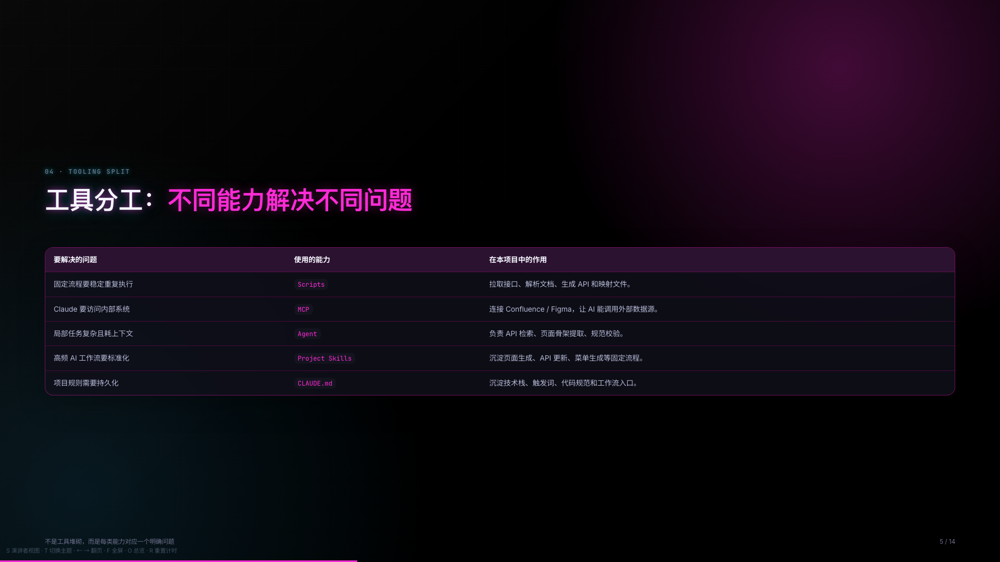

这一页主要讲工具分工。

我不是为了用新技术而堆工具，而是每类能力都对应一个明确问题。

第一个是 **Scripts**。

固定流程要稳定重复执行，就适合用 Scripts。比如接口拉取、文档解析、API 生成、页面映射生成。这些事情输入输出明确，脚本执行最稳定，也方便后续维护和排查。

第二个是 **MCP**。

Claude 要访问内部系统，比如 Confluence 或 Figma，就需要 MCP。MCP 可以理解成 AI 调用外部系统的工具协议。通过 MCP，Claude 不只是聊天，它可以调用工具去抓页面、读设计稿、生成映射。

第三个是 **Agent**。

有些子任务比较复杂，而且会占用很多上下文，比如查 API、分析参考页面结构、做规范校验。如果都放在主 Claude 上下文里，会让主对话越来越长，也容易混乱。

所以我把这类任务交给子 Agent。子 Agent 可以专注做一件事，输出结构化结果。这样既能节省主上下文，也能让主 Claude 负责整体判断和整合。

第四个是 **项目级 Skill**。

我把 HRMS 里的高频 AI 工作流沉淀成了几个项目级 Skill：比如 `design-to-code` 负责设计稿、截图、参考页面到 Vue 页面生成；`generate-api` 负责接口更新；`update-api` 负责 API 和页面映射的全部同步；`generate-menu-import` 负责菜单导入 JSON。

这样做的好处是，页面生成和接口更新不再靠临时 prompt，而是沉淀成固定步骤。以后再做类似任务，AI 会按同一套流程识别输入、查接口、提骨架、确认字段、生成代码和校验规范。

最后是 **CLAUDE.md**。

它负责把项目规则持久化，比如技术栈、目录规范、触发词、代码生成要求。这样 AI 每次进入项目，都能先知道基本规则。

所以这套分工不是工具堆砌，而是：Scripts 解决稳定执行，MCP 解决外部系统连接，Agent 解决复杂子任务，项目级 Skill 解决高频工作流标准化，CLAUDE.md 解决项目规则持久化。

---

## 第 6 页：AI 提效落地思路

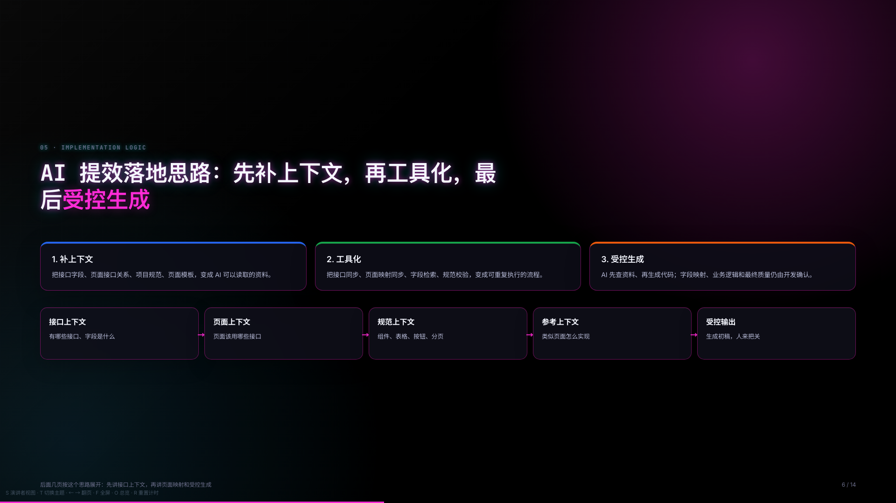

前面讲了问题、目标、架构和工具分工。

这里我补一层落地思路，不然后面直接讲接口链路会有点突然。

我没有把目标定成“让 AI 自动写页面”。

因为这样风险很大。AI 如果没有项目上下文，就会自编字段、乱用组件，甚至写出看起来合理、但实际不可用的代码。

所以我的落地思路分三步。

第一步，**补上下文**。

把接口字段、页面接口关系、项目规范、页面模板，都变成 AI 可以读取的资料。比如接口字段来自 Torna，页面和接口关系来自 Confluence，代码规范来自 CLAUDE.md 和 docs。

第二步，**工具化**。

把重复流程变成可以执行的工具，比如接口同步、页面映射同步、字段检索、规范校验。这一步的意义是，不靠人工记流程，也不靠每次临时复制粘贴。

第三步，**受控生成**。

AI 不是直接替代开发，而是在已有上下文和工具约束下生成初稿。字段映射、业务逻辑和最终质量，仍然由开发人员确认。

所以接下来几页，我会按这个思路展开：先讲接口上下文怎么自动化；再讲页面接口关系怎么同步；最后讲 AI 怎么在这些上下文里受控生成页面。

---

## 第 7 页：接口链路

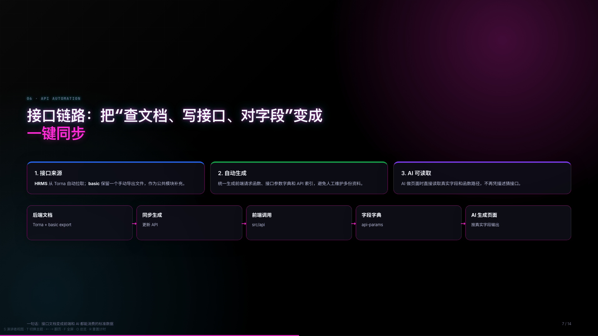

先看第一块：接口链路。

以前开发一个页面，前端通常要先去 Torna 查接口，再确认入参和出参，然后手动写 API 函数，最后再根据字段去写页面。

这些工作重复性很高，而且一旦后端接口文档更新，前端很容易漏同步。

现在我把这条链路做成了自动化。

HRMS 核心接口从 Torna 自动拉取。basic 模块因为是公共基础模块，我们只用到其中一部分，变更频率也相对低，所以保留一个手动导出的 `export-basic.md` 作为补充输入。

这部分对应的是我沉淀的 `generate-api` 项目级 Skill。

它把“更新 API”这件事固定成标准流程：先拉 Torna，再合并 basic，最后生成前端 API、参数字典和索引。

这里也可以把技术落地点讲清楚：Skill 负责定义流程和入口，`fetch-torna-export.js` 负责通过 Torna API 自动拉取 HRMS 接口文档，`generate-api.js --hybrid` 负责把 Torna JSON 和 basic 的手动 export 合并，生成最终产物。

也就是说，这里不是让 AI 临时读一份文档再写代码，而是把“拉接口、解析接口、生成代码和字段字典”沉淀成一个项目级 Skill 加脚本的固定工作流。AI 后续再读取这些产物辅助页面开发。

然后统一生成三类东西。

第一，前端实际调用的 `src/api`。第二，AI 和开发都能读取的接口参数字典。第三，API 索引和参考文档。

这样接口文档就不只是给人看的文档，而是变成前端和 AI 都可以消费的标准数据。

这条链路的核心价值是：后端维护 Torna，前端同步生成，AI 基于真实接口字段辅助开发。

---

## 第 8 页：页面映射

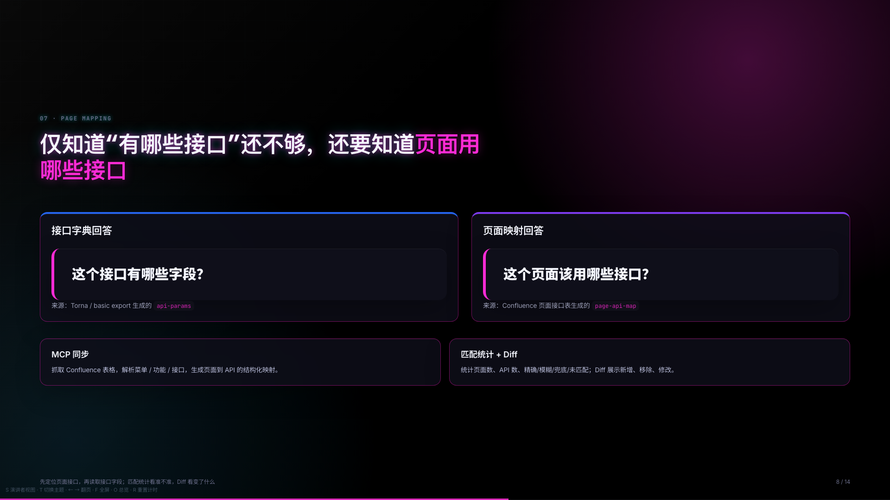

前面讲的是接口字段。

但是只知道有哪些接口还不够。

做页面时，还有一个更关键的问题：**这个页面到底应该用哪些接口？**

接口字典回答的是：“这个接口有哪些字段？”

页面映射回答的是：“这个页面该用哪些接口？”

这两个问题是不一样的。

接口定义在 Torna 里，但是页面和接口的关系，更多是在 Confluence 的页面接口表里维护。

所以我用 MCP 把 Confluence 页面表格同步下来，生成 `page-api-map`。

AI 做页面时，会先通过页面映射定位这个页面对应的接口，再回到接口参数字典里读取字段。

这样比让 AI 在几百个接口里自由搜索更准确，也更符合真实业务页面关系。

这一页下半部分是技术补充：MCP 会抓取 Confluence 表格，解析菜单、功能、接口名称、接口地址等列，再生成结构化页面映射。

同步后还会输出匹配统计和 Diff 报告。

匹配统计会展示抓取页面数、提取 API 数、名称精确匹配、名称模糊匹配、URL 精确匹配、关键词兜底、模块兜底和未匹配数量。

这个统计的目的不是单纯展示数量，而是判断生成得准不准。比如未匹配数量突然变多，就说明可能是 Confluence 表格写法变了、接口名称和 Torna 不一致，或者本地 API 字典没有更新。

Diff 报告则关注“变了什么”，比如哪个页面新增了接口，哪个页面移除了接口，接口地址、匹配类型或前端函数是否变化。

所以页面映射不是黑盒生成文件，而是可检查、可追踪的同步流程。

简单说：`api-params` 解决字段问题，`page-api-map` 解决页面用接口的问题；匹配统计看准不准，Diff 报告看变了什么。

---

## 第 9 页：AI 页面生成

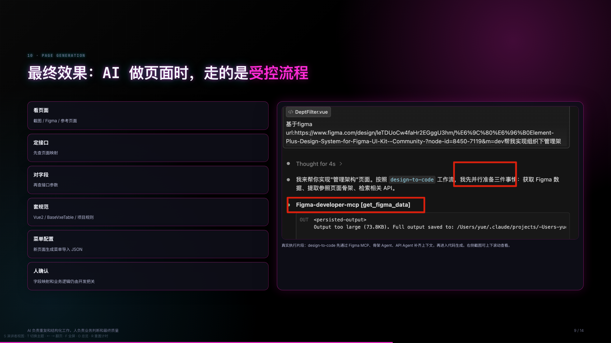

前面几页讲了接口字典和页面映射，这一页把它们放回页面生成场景里。

AI 做页面时，不是直接拿一句话就写代码，而是走一个受控流程。

第一步，**看页面**。

输入可以是截图、Figma、参考页面或者业务描述。

第二步，**定接口**。

先通过页面映射，也就是 `page-api-map`，判断这个页面应该用哪些接口。

第三步，**对字段**。

再通过 `api-params` 查这些接口的入参和出参。

第四步，**套规范**。

按项目技术栈和规范生成代码，比如 Vue 2 Options API、BaseVxeTable、Element UI、分页规则、按钮位置等。

第五步，**菜单配置**。

如果是新页面，还需要能被系统菜单挂载。所以这里会补一段菜单导入 JSON，方便后续在基础服务里配置菜单。

第六步，**人确认**。

字段映射、业务逻辑、权限边界、菜单层级和最终质量，仍然由开发确认。

这部分对应的是 `design-to-code` 项目级 Skill。

它把页面生成拆成固定步骤：识别输入是截图、Figma 还是参考页面；查 API；提取参考页面骨架；生成字段映射；字段确认后再写代码；最后做规范校验。

另外，新页面不只是生成 Vue 文件，还需要能被系统菜单挂载。所以我也沉淀了 `generate-menu-import` 项目级 Skill。它会根据已有 Vue 页面、页面标题、路径和当前菜单层级，生成基础服务可导入的菜单 JSON，减少手工配置菜单层级和权限字段的错误。

右侧展示的是实际执行截图。

可以看到，它不是直接开始写 Vue 页面，而是先通过 Figma MCP 获取设计稿节点数据。这样视觉结构不是只靠截图猜，而是能拿到更准确的节点信息。

同时，它会用子 Agent 提取参考页面骨架。这里不是照抄参考页面的业务字段，而是提取页面结构和实现模式，比如搜索区、表格、弹窗、分页这些骨架。

它还会用 API Agent 检索候选接口，把大量文档查找从主 Claude 上下文里拆出去。

这个设计有一个技术上的好处：查资料、读文档、提骨架这些任务很耗上下文，如果都放在主 Claude 里，主上下文会变得很长，也容易干扰后续代码生成。用子 Agent 后，主 Claude 只接收结构化结论，再负责整体决策和代码整合。

所以这一页的核心是三个“不让”：不让 AI 猜接口；不让 AI 乱写组件；不让 AI 失控上线。

AI 负责重复和结构化工作，人负责业务判断和质量把关。

---

## 第 10 页：菜单导入 JSON

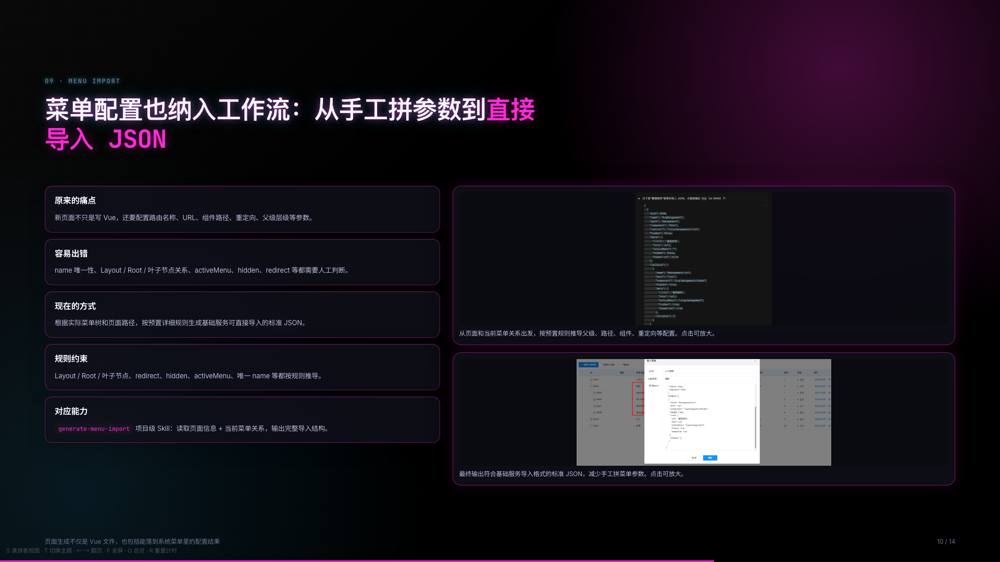

这里我补充一个之前容易被忽略，但实际开发里很花时间的环节：**菜单配置**。

新页面写完 Vue 文件以后，并不代表就能在系统里访问。还需要在基础服务里配置菜单。

这里面有很多参数需要人工判断，比如路由名称、访问 URL、组件路径、父级菜单层级、重定向、是否隐藏、activeMenu、按钮权限等。

这些配置如果靠手工拼，非常容易出错。

比如 name 要唯一，Layout 下面不能直接挂页面，中间要有 Root；叶子节点要对应真实页面路径；详情页还要考虑高亮父菜单；有些父级还要配置 redirect。

所以我把这一步也沉淀成了 `generate-menu-import` 项目级 Skill。

它会根据已有 Vue 页面、页面标题、路径和当前菜单树，按预置的详细规则推导出基础服务可直接导入的标准菜单 JSON。

这些规则包括：Layout 下只能挂 Root，页面必须挂在 Root 下，叶子节点要对应真实页面路径，叶子节点 hidden、父级 redirect、详情页 activeMenu、菜单 name 唯一性等，都按规则处理。

右边两张图展示的就是这个过程：先根据页面和现有菜单关系推导父级、路径、组件、重定向等配置；再输出可以直接导入基础服务的 JSON。

这一步的价值是，把“页面写完以后还要手工想菜单怎么配”的工作，也纳入 AI 工作流。

这样新页面从代码到菜单配置可以形成闭环，减少人工拼参数和层级配置错误。

---

## 第 11 页：AI 提效的真实边界

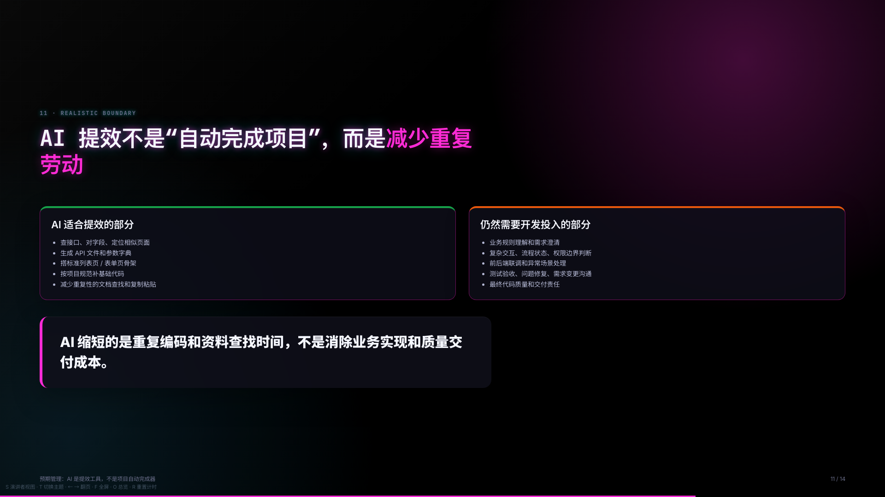

这一页我想主动讲一下 AI 提效的真实边界，避免大家产生一个误解：是不是有了这套工作流，页面就可以自动完成，项目就会很快结束？

实际不是这样。

AI 在这个项目里最适合提效的，是标准化、重复性强、规则比较明确的部分。

比如查接口、对字段、定位相似页面、生成 API 文件、搭标准列表页骨架、按项目规范补基础代码。

这些工作过去比较耗时间，但本质上重复性强，适合交给 AI 和工具链处理。

但是还有很多事情仍然需要开发投入时间。

比如业务规则理解、需求澄清、前后端联调、复杂交互、流程状态、权限边界、异常场景处理、测试验收、问题修复、需求变更沟通。

这些事情不是 AI 能直接替代的。

所以我对这套工作流的定位不是：“让 AI 替代开发完成项目”。而是：“让 AI 减少重复劳动，让开发把时间更多放在业务判断和质量交付上”。

这也是我前面一直强调受控生成和人工确认的原因。

---

## 第 12 页：形成的价值

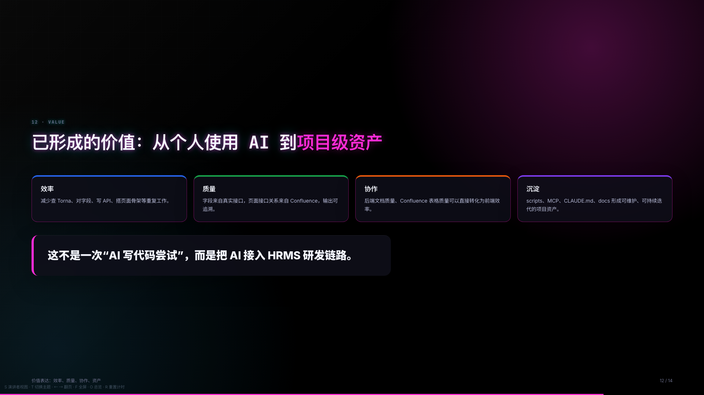

这一页总结目前已经形成的价值。

第一是**效率**。

减少查 Torna、对字段、写 API、搭页面骨架这些重复工作。

第二是**质量**。

字段来自真实接口文档，页面接口关系来自 Confluence，代码生成受项目规范约束，输出更可追溯。

第三是**协作**。

后端维护好 Torna，Confluence 维护好页面接口关系，前端就可以自动同步。

这实际上把文档质量和开发效率连接起来了。

第四是**沉淀**。

这些不是一次性的提示词，而是沉淀成项目里的 Scripts、MCP、CLAUDE.md 和 docs 知识库。

所以这件事的价值，不只是某一次页面生成快了一点，而是形成了一套后续可以持续维护、持续复用的项目资产。

后续这套流程会继续围绕 HRMS 页面开发迭代，而不是一次性做完就结束。

---

## 第 13 页：下一步规划

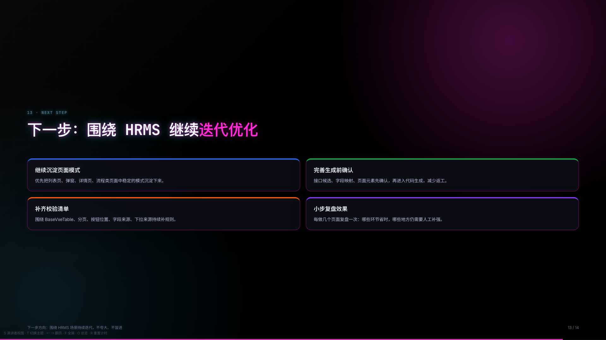

最后讲下一步。

这里我不想把目标说得太大，还是围绕 HRMS 当前项目持续迭代。

第一，继续沉淀页面模式。

优先把列表页、弹窗、详情页、流程类页面里比较稳定、重复出现的结构沉淀下来，让 AI 在这些标准场景里更好发挥作用。

第二，完善生成前确认。

比如接口候选、字段映射、页面元素，尽量在生成代码前先确认清楚，减少后面返工。

第三，补齐校验清单。

围绕 BaseVxeTable、分页、按钮位置、字段来源、下拉来源这些项目规范，持续补充检查规则。

第四，小步复盘效果。

不是一次性把 AI 说得很满，而是每做几个页面复盘一次，看看哪些环节确实省时，哪些地方仍然需要人工补强。

最后总结一下：这套实践的核心价值是三点。

第一，把项目知识结构化；第二，把重复流程自动化；第三，把 AI 使用工程化。

但它仍然需要持续迭代，也需要开发在业务理解、联调和质量交付上继续把关。

谢谢大家。
## 第 14 页：风险控制

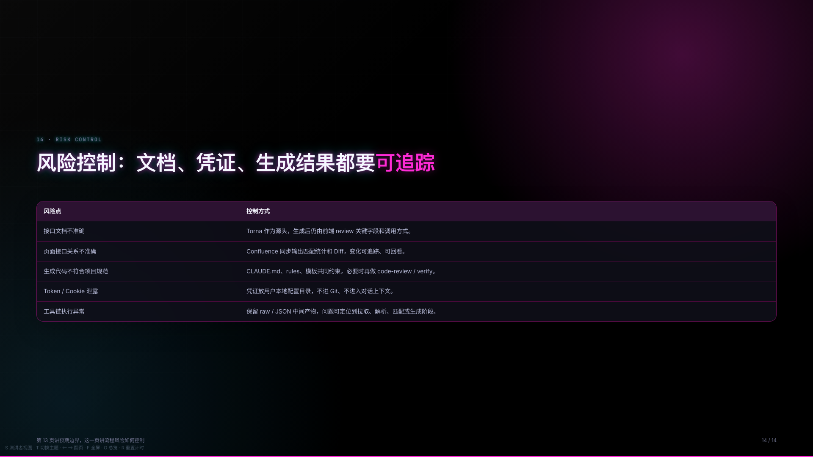

前面第 13 页讲的是 AI 提效的真实边界。

这一页讲的是风险控制。

重点不是再说 AI 不能替代开发，而是说明这套流程如何做到可追踪、可排查、可审核。

第一类风险是**接口文档不准确**。

接口文档以 Torna 为源头，但生成后仍然需要前端 review 关键字段和调用方式。

第二类风险是**页面接口关系不准确**。

Confluence 同步会输出匹配统计和 Diff。也就是说，如果页面接口关系有变化，我们可以看到变化，不是静默覆盖。

第三类风险是**生成代码不符合规范**。

这里通过 CLAUDE.md、rules、模板来约束。必要时还可以做 code-review 或 verify。

第四类风险是**凭证安全**。

Torna Token 和 Confluence Cookie 都放在用户本地配置目录，不进 Git，也不进入对话上下文。

第五类风险是**工具链执行异常**。

这类问题通过保留 raw、JSON 等中间产物来定位。问题可以拆到拉取、解析、匹配、生成几个阶段排查。

所以整体目标是：让 AI 工作流可用，同时过程可追踪，凭证可控，结果可审核。

---

